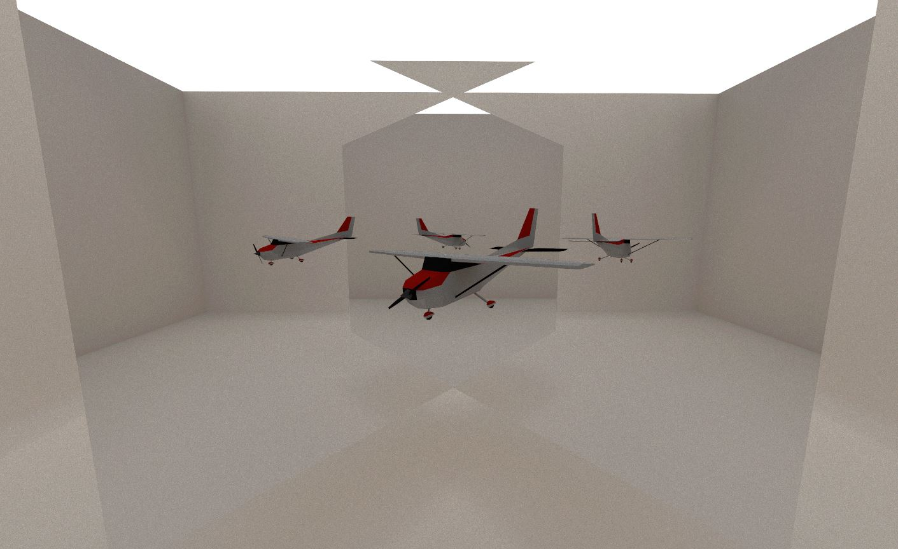
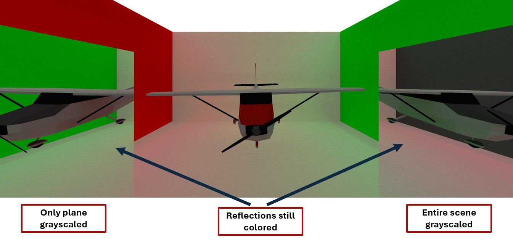
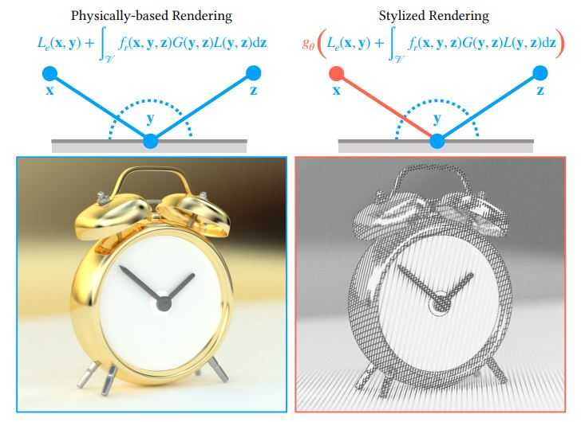

## WebGPU Pathtracer

||
|:--:|
|Skull Conference|

Authors: 
- Alan Lee ([LinkedIn](https://www.linkedin.com/in/soohyun-alan-lee/), [Portfolio](https://www.alannos.com/))
- Jordan Hochman ([LinkedIn](https://www.linkedin.com/in/jhochman24), [Personal Website](https://jordanh.xyz), [GitHub](https://github.com/JHawk0224))
- Maya Diaz Huizar ([GitHub](https://github.com/Aorus1))

This project showcases a WebGPU pathtracer that supports non-photorealistic rendering techniques and progressive dynamics for cloth simulation based on recent SIGGRAPH papers.

The pathtracer was implemented using primarily wgsl and typescript.

You can directly experience the live demo at our website on [GitHub page](https://alan7996.github.io/WebGPU-NPR/). 

### Live Demo

Click on the image below to test our project on your own browser!

## Contents

- `src/` contains all the TypeScript and WGSL code for this project. This contains several subdirectories:
  - `renderers/` defines the different renderers that can be selected. Currently only NPR pathtracer is supported
  - `shaders/` contains the WGSL files that are interpreted as shader programs at runtime, as well as a `shaders.ts` file which preprocesses the shaders
  - `stage/` includes camera controls, scene loading, and lights, where you will implement the clustering compute shader
- `scenes/` contains all models that can be used in the test scene

## Running the code

Follow these steps to install and view the project:
- Clone this repository
- Download and install [Node.js](https://nodejs.org/en/)
- Run `npm install` in the root directory of this project to download and install dependencies
- Run `npm run dev`, which will open the project in your browser
  - The project will automatically reload when you edit any of the files

## Core Features

### Pathtracer

||
|:--:|
|Reflections of a Red Airplane|

Our pathtracer consists of multiple compute shader passes and a single WebGPU render pass. For each frame, we 
1. generate camera rays
2. perform ray-scene intersection tests
3. shade materials and stylize
4. repeat steps 2 and 3 until either no valid paths remain or maximum ray depth has been reached
5. combine current frame's image with previous frames' accumulated result
6. render latest combination as a render texture

Steps 1 through 5 occur as compute shader passes, and step 6 is a render pass on the triangulated screen-space.

We utilize stochastic sampled anti-aliasing in camera ray generation stage. Ray-scene intersections were accelerated using a bounding volume hierarchy. Rendered frame accumulation resets on any camera movement.

Note that each frame is equivalent to taking a single-sample monte carlo estimate of the rendering equation for the scene. The end result of accumulating indefinitely given absence of camera movement is essentially allowing us to average out N frames of such estimates, leading to a quick and progressive convergence.

### Non-Photorealistic Rendering

||
|:--:|
|Example of stylization depending on path prefixes|

Our pathtracer supports two rendering modes: regular pathtracer and pathtracer with non-photorealistic rendering (NPR). Based on a [SIGGRAPH 2024 paper](http://cv.rexwe.st/pdf/srfoe.pdf), the NPR mode performs `stylize` function on every material shader invocation.

This renderer is a surface-based renderer (i.e. no volumetric interactions), so we only consider stylization on surfaces. This means we can simply make "style functions" tied to materials interface and properties.

Rex et al. achieves seamless integration of non-photorealistic stylization in a physics-based renderer by using three functions: `shouldStylize`, `requiredSamples`, and `stylize`. This implementation covers `shouldStylize` and `stylize` functions, and `requiredSamples` remains as a future work to be done. This means instead of having a various number of outgoing radiance samples needed for style estimator, we always approximate the outgoing radiance with one sample, similar to our regular pathtracer's behavior.

||
|:--:|
|Rendering equation as a function of expectation|

`stylize` function is in essence an estimator function that takes in all parameters at a given point of intersection and a) determines if there should be a stylization and b) if so perform the stylization accordingly. This estimation process can be similarly thought of as applying a filter to any region that satisfies predefined conditions. The result is a robust stylization scheme that works in any physics-based environment where we can manipulate stylization on the object itself, reflections, recursive layers of scattering, and so on.

Our implementation defines parameters affecting stylization consideration as `StyleContext` struct given in `common.wgsl`. By default this includes materialId, objectId, path prefix (last object hit), intersection position, intersection surface normal, incoming ray direction, and current intersection's BVH node index. This struct can be easily expanded to include additional parameters such as camera ray direction or parent object's ID that can be used inside the `stylize` function.

### Cloth Simulation

## Analysis

## Credits

- [Stylized Rendering as a Function of Expectation (2024)](http://cv.rexwe.st/pdf/srfoe.pdf)
- [Progressive Simulation for Cloth Quasistatics (2023)](https://pcs-sim.github.io/pcs-main.pdf)
- [Progressive Dynamics for Cloth and Shell Animation (2024)](https://pcs-sim.github.io/pd/progressive-dynamics-main.pdf) 

- [Vite](https://vitejs.dev/)
- [loaders.gl](https://loaders.gl/)
- [dat.GUI](https://github.com/dataarts/dat.gui)
- [stats.js](https://github.com/mrdoob/stats.js)
- [wgpu-matrix](https://github.com/greggman/wgpu-matrix)
- [wgpu-basecode](https://github.com/CIS5650-Fall-2024/Project4-WebGPU-Forward-Plus-and-Clustered-Deferred)
- [Halo Spartan Model](https://skfb.ly/6QVvM)